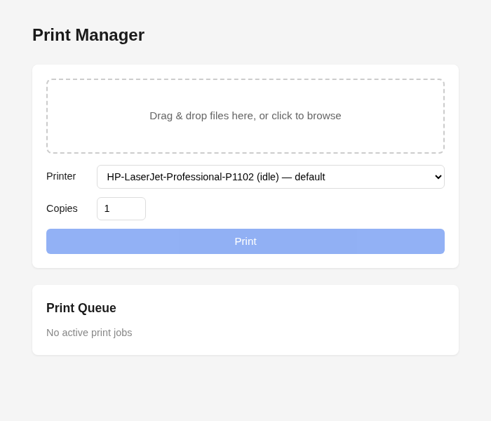
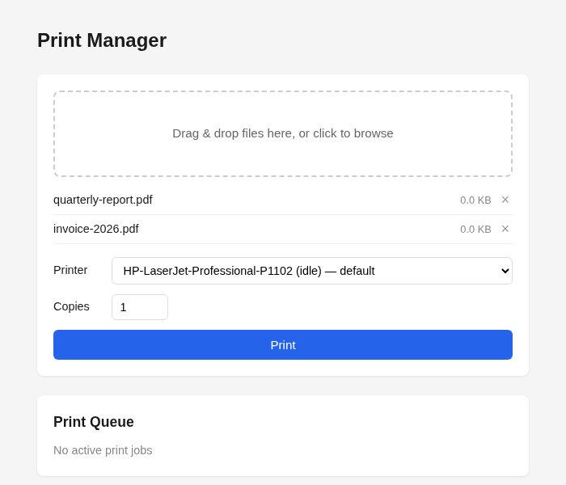

# Print Manager

Web UI for printing files on CUPS printers. Drag & drop files, pick a printer, print.





## Run

```bash
bun install
bun run build
pm2 start ecosystem.config.cjs
```

Runs on `http://0.0.0.0:4000`.

## Dev

```bash
bun run dev
```

Frontend on `:5173`, server on `:3000`.
